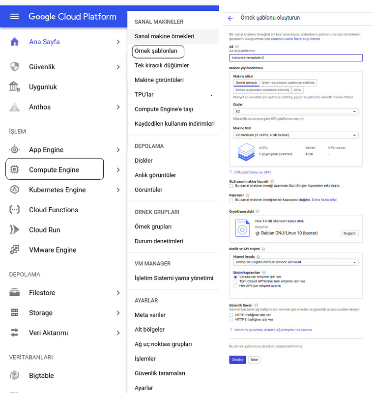
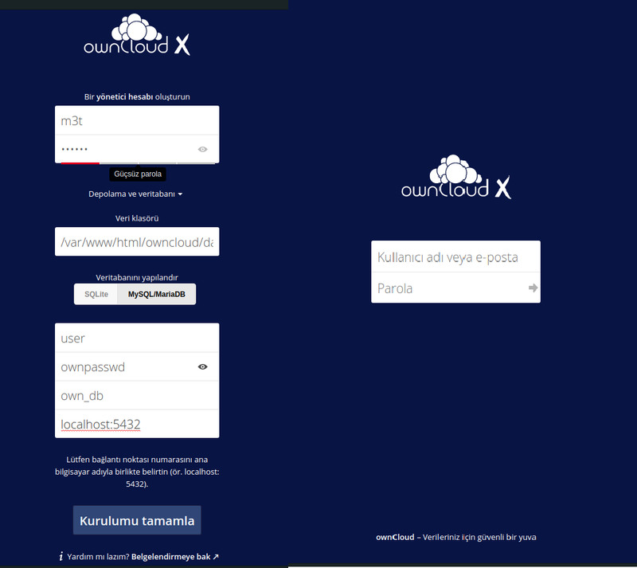
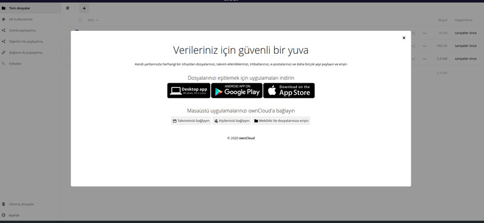

    body { padding: 25px; background-color: #282b34; color: #efefef; font-size: 18px; } pre { margin: 20px; padding: 20px; color: #aaa; background-color: #222; white-space: pre; text-shadow: 0 1px 0 #000; border-radius: 15px; border-bottom: 1px solid #555; box-shadow: 0 1px 5px rgba(0,0,0,0.4) inset, 0 0 20px rgba(0,0,0,0.2) inset; font: 16px/24px 'Courier New', Courier, 'Lucida Sans Typewriter', 'Lucida Typewriter', monospace; } .dark-mode { background-color: #f2e4e2; color: black; } .container img { width: 100%; height: auto; } .container .btn { position: absolute; top: 50%; left: 50%; transform: translate(-50%, -50%); -ms-transform: translate(-50%, -50%); background-color: #f1f1f1; color: black; font-size: 16px; padding: 16px 30px; border: none; cursor: pointer; border-radius: 5px; text-align: center; } .container .btn:hover { background-color: black; color: white; } .container2 { position: relative; width: 100%; max-width: 400px; } .container { margin: 0 auto; width:960px; } Dark Mode Light Mode

CentOS 7'ye OwnCloud Server Kurulumu
====================================

Bu yazımda GNU/Linux sistem yönetimi çalışmalarımda öğrendiklerimi pekiştirmek amacıyla Google Cloud'dan ücretsiz olarak kiraladığım Centos Linux'un içine kurduğum Owncloud serverinden bahsedeceğim.

OwnCloud Nedir?
---------------

OwnCloud, açık kaynak kodlu dosya barındırma sistemidir. Kullanıcılar OwnCloud'u özel bir sunucu içerisine kurarak hiçbir ücret ödemeden (yazılıma) kullanabilir.

[wiki](https://tr.wikipedia.org/wiki/OwnCloud )

[owncloud](https://owncloud.com/faq/)

Google Cloud üzerinde örnek makine oluşturma
--------------------------------------------

Ben 3 ay 300$ dolar kupon hakkı ile kiraladığım Google Cloud'a kurulum gerçekleştiriyorum.

*   https://cloud.google.com/ da konsol git diyerek başlayalım.

*   Compute Engine seçip ve örnek şablon oluştur seçelim.

*   Makinemize ad verelim, ad verirken küçük harf ve boşluk olmadan yazmaya dikkat edelim.

*   Dizilerde CPU platform seçimini yapalım. Ben CPU platform seçiminde E2 (Müsaitlik durumuna göre CPU platformunu seçtim) olanını seçtim.

*   Makine türünde ise vCPU çekirdek sayısını ve belleğini seçelim.<

*   Ben paylaşılan çekirdeklerden e2 - medium (2 vCPU 4 GB bellek) olanı seçtim.

*   Ön yükleme diskinde ise İşletim sistemi, işletim sistemi sürümü, disk türü ve disk boyutunu seçiyoruz. Ben İşletim sistemi olarak Centos sürümü olarak Centos 7'yi, disk türü olarak standart kalıcı disk'i ve boyut olarak da 20 GB disk boyutu verdim.

*   Güvenlik duvarı izinlerimiz de verelim ve makinemizi oluşturalım.

[Google Cloud](https://cloud.google.com/)

### SSH Ayarları

*   SSH ayarımız için sanal makinemizin üzerine tıklayarak sanal makine örneği ayrıntıları sayfasına gelelim ve o sayfada düzenle yazısını seçelim.

*   Düzenle sayfasında SSH Anahtarlarını seçelim.

    
    $ ssh-keygen
    Generating public/private rsa key pair.
    Enter file in which to save the key (/home/kullanıcı/.ssh/id_rsa): owncloud1
    Enter passphrase (empty for no passphrase): 
    Enter same passphrase again: 
    Your identification has been saved in owncloud1
    Your public key has been saved in owncloud1.pub
    The key fingerprint is:
    SHA256:H1Zboaqte7HwesFLDL/4nsuOYy8Uy3Olu6va7IQcBBg m3t@manjaro
    The key's randomart image is:
    +---[RSA 3072]----+
    |  Eo.         .  |
    |  .  .       . . |
    |      .     o .  |
    |     .  o  o.o   |
    |      ..SB+o.    |
    |     . o*=X.     |
    |      o.oBoB     |
    |       +=+O.     |
    |      .+X&@+     |
    +----[SHA256]-----+
    

*   Linux terminalimde ssh-keygen ile SSH keylerimi oluşturdum.

*   Owncloud1 adında bir key oluşturdum. Boş bırakırsak /home/kullanıcı/. ssh/ altına id\_rsa. pub adında Public key hem de id\_rsa adında Private key oluşturur.

*   Keylere parola vermeden işlem yaptım ve çıktım.

    
    $ cat owncloud1.pub
    ssh-rsa AAAAB3NzaC1yc2EAAAADAQABAAABgQDT7dRdtznSP6QUSFmyeQRj25S+7EmrjoBEyt7MiXzwsP6MkRRRPy8oFHMzvgf+he3acdgRpXP3wW7ewBtXhxu2DMbZp53sAnxgDa5nvC8E/2yNc90KEZQABrPDEQDvrGFF+qSPFCl7QpR9KnABoRii10cwGGiqIwNzhUMt5fWXRNweTdstR/uAj607a9rDzFB2TNMSYelw57dzRzM9m763jUzNwl/kfl46k7/VZ9PMr7Sogrb+V0zf17iVHai01vZU8zEB2fu9RBEb2KqJJ4dtFGSsn4XDKeEPHTmn8xzpauixVi0klFYhGIaBJ3TrkuOoJEg2ei9Xg7ZX1MshJV4ceTh6Xy4l1iksTIvXDyw8rZ+3UXwSy008FkYhQIlTiZjw1LAKJVJIiae6I+3YpTn9vEx1ibEmRFPr4CdDtXt4/nkNIb0myk1PM+lkV7TtrvbWy+Cn2Htbt/LvQQ7RqB4h+5rQw+toCndQMUlpNjVl10a/tVfGQsMD/ML2F1+iHf0= m3t@manjaro
    $
    

*   Owncloud1. pub Public keyi kopyalayalım ve Googlecloud'daki SSH anahtarları yerine yapıştıralım ve kaydedelim.

    
    $ ssh -i owncloud1 m3t@34.69.43.29
    

*   Ssh - i ile Private key dosya ismini, kullanıcı adımızı ve Google Cloud'daki harici ipimizi vererek artık giriş yapabiliriz.

    
    m3t@owncloud2 ~]$ sudo passwd
    Changing password for user root.
    New password:
    

*   Sisteme girdikten sonra "sudo passwd " komutu ile root parolası oluşturalım Arrtık ssh ile sistemimize girip OwnCloud kurabiliriz.

Hadi Başlıyalım
---------------

### Kurulum Gereksinimleri

*   PHP 7.2

*   Apache Web Server

*   MariaDB MariaDB Server

*   OwnCloud server kurulum dosyası

Gereksinim listemizde hazır olduğuna göre artık gereksinimleri indirip kurmaya başlayalım.

### PHP 7.2 - Apache Web Server Kurulumu

*   "yum install epel-release" komutu ile epel ("Extra Packages for Enterprise Linux" topluluk temelli repo projedir) reposunu kuruyoruz.

*   "yum install yum-utils" komutu ile yum-config-manager’ı kullanmak için yum-utils paketini kuruyoruz ,"-y" komutunu ise bizden yes komut istememesi için veriyoruz.

    
    [root@owncloud m3t]# yum install epel-release yum-utils -y
    Loaded plugins: fastestmirror
    Determining fastest mirrors
    epel/x86_64/metalink                                                                                                                                                   |  16 kB  00:00:00     
     * base: mirrors.gigenet.com
     * epel: mirror.genesisadaptive.com
     * extras: repos.forethought.net
     * updates: ftp.ussg.iu.edu
    base                                                                                                                                                                   | 3.6 kB  00:00:00     
    epel                                                                                                                                                                   | 4.7 kB  00:00:00     
    extras                                                                                                                                                                 | 2.9 kB  00:00:00     
    google-cloud-sdk/signature                                                                                                                                             |  844 B  00:00:00     
    google-cloud-sdk/signature                                                                                                                                             | 1.4 kB  00:00:00 !!! 
    google-compute-engine/signature                                                                                                                                        |  844 B  00:00:00     
    google-compute-engine/signature                                                                                                                                        | 1.4 kB  00:00:00 !!! 
    updates                                                                                                                                                                | 2.9 kB  00:00:00     
    (1/9): base/7/x86_64/group_gz                                                                                                                                          | 153 kB  00:00:00     
    (2/9): base/7/x86_64/primary_db                                                                                                                                        | 6.1 MB  00:00:00     
    
    ==============================================================================================================================================================================================
    Install  1 Package (+3 Dependent packages)
    
    Total download size: 863 k
    Installed size: 4.3 M
    Downloading packages:
    (1/4): libxml2-python-2.9.1-6.el7.5.x86_64.rpm                                                                                                                         | 247 kB  00:00:00     
    (2/4): python-chardet-2.2.1-3.el7.noarch.rpm                                                                                                                           | 227 kB  00:00:00     
    (3/4): yum-utils-1.1.31-54.el7_8.noarch.rpm                                                                                                                            | 122 kB  00:00:00     
    (4/4): python-kitchen-1.1.1-5.el7.noarch.rpm                                                                                                                           | 267 kB  00:00:00     
    ----------------------------------------------------------------------------------------------------------------------------------------------------------------------------------------------
    Total                                                                                                                                                         2.5 MB/s | 863 kB  00:00:00     
    Running transaction check
    Running transaction test
    Transaction test succeeded
    Running transaction
      Installing : python-chardet-2.2.1-3.el7.noarch                                                                                                                                          1/4 
      Installing : python-kitchen-1.1.1-5.el7.noarch                                                                                                                                          2/4 
      Installing : libxml2-python-2.9.1-6.el7.5.x86_64                                                                                                                                        3/4 
      Installing : yum-utils-1.1.31-54.el7_8.noarch                                                                                                                                           4/4 
      Verifying  : libxml2-python-2.9.1-6.el7.5.x86_64                                                                                                                                        1/4 
      Verifying  : python-kitchen-1.1.1-5.el7.noarch                                                                                                                                          2/4 
      Verifying  : yum-utils-1.1.31-54.el7_8.noarch                                                                                                                                           3/4 
      Verifying  : python-chardet-2.2.1-3.el7.noarch                                                                                                                                          4/4 
    
    Installed:
      yum-utils.noarch 0:1.1.31-54.el7_8                                                                                                                                                          
    
    Dependency Installed:
      libxml2-python.x86_64 0:2.9.1-6.el7.5                           python-chardet.noarch 0:2.2.1-3.el7                           python-kitchen.noarch 0:1.1.1-5.el7                          
    

*   "yum install http://rpms.remirepo.net/enterprise/remi-release-7.rpm -y" komutu ile güncel repoyu çekiyoruz.

    
    [root@owncloud m3t]#yum install http://rpms.remirepo.net/enterprise/remi-release-7.rpm -y
    Loaded plugins: fastestmirror
    remi-release-7.rpm                                                                                                                                                     |  20 kB  00:00:00     
    Examining /var/tmp/yum-root-4Z_a_v/remi-release-7.rpm: remi-release-7.8-1.el7.remi.noarch
    Marking /var/tmp/yum-root-4Z_a_v/remi-release-7.rpm to be installed
    Resolving Dependencies
    --> Running transaction check
    ---> Package remi-release.noarch 0:7.8-1.el7.remi will be installed
    --> Finished Dependency Resolution
    
    Dependencies Resolved
    
    ==============================================================================================================================================================================================
     Package                                       Arch                                    Version                                         Repository                                        Size
    ==============================================================================================================================================================================================
    Installing:
     remi-release                                  noarch                                  7.8-1.el7.remi                                  /remi-release-7                                   28 k
    
    Transaction Summary
    ==============================================================================================================================================================================================
    Install  1 Package
    
    Total size: 28 k
    Installed size: 28 k
    Downloading packages:
    Running transaction check
    Running transaction test
    Transaction test succeeded
    Running transaction
      Installing : remi-release-7.8-1.el7.remi.noarch                                                                                                                                         1/1 
      Verifying  : remi-release-7.8-1.el7.remi.noarch                                                                                                                                         1/1 
    
    Installed:
      remi-release.noarch 0:7.8-1.el7.remi                                                                                                                             

*   "yum-config-manager --enable remi-php72" repodaki php72 aktif ediyoruz.

    
    [root@owncloud m3t]# yum-config-manager --enable remi-php72 
    Loaded plugins: fastestmirror
    ====================================================================================== repo: remi-php72 ======================================================================================
    [remi-php72]
    async = True
    bandwidth = 0
    base_persistdir = /var/lib/yum/repos/x86_64/7
    baseurl = 
    cache = 0
    cachedir = /var/cache/yum/x86_64/7/remi-php72
    ...
    ssl_check_cert_permissions = True
    sslcacert = 
    sslclientcert = 
    sslclientkey = 
    sslverify = True
    throttle = 0
    timeout = 30.0
    ui_id = remi-php72
    ui_repoid_vars = releasever,
       basearch
    username 
    

*   "yum install httpd php php-mysql php-intl sqlite php-dom php-mbstring php-gd php-pdo php-json php-xml php-zip php-gd curl php-curl php-mcrypt php-pear -y" php ve diğer gerekli bağımlılıkları ve httpd (Apache Web Server) kuruyoruz.

    
    
    root@owncloud m3t]# yum install httpd php php-mysql php-intl sqlite php-dom php-mbstring php-gd php-pdo php-json php-xml php-zip php-gd curl php-curl php-mcrypt php-pear -y
    Loaded plugins: fastestmirror
    Loading mirror speeds from cached hostfile
     * base: mirrors.gigenet.com
     * epel: mirror.genesisadaptive.com
     * extras: repos.forethought.net
     * remi-php72: mirror.team-cymru.com
     * remi-safe: mirror.team-cymru.com
     * updates: ftp.ussg.iu.edu
    remi-php72                                                                                                                                                             | 3.0 kB  00:00:00     
    ....
    Dependency Installed:
      apr.x86_64 0:1.4.8-7.el7                  apr-util.x86_64 0:1.5.2-6.el7                      dejavu-fonts-common.noarch 0:2.33-6.el7         dejavu-sans-fonts.noarch 0:2.33-6.el7         
      fontconfig.x86_64 0:2.13.0-4.3.el7        fontpackages-filesystem.noarch 0:1.44-8.el7        fribidi.x86_64 0:1.0.2-1.el7_7.1                gd-last.x86_64 0:2.3.0-2.el7.remi             
      graphite2.x86_64 0:1.3.10-1.el7_3         harfbuzz.x86_64 0:1.7.5-2.el7                      httpd-tools.x86_64 0:2.4.6-97.el7.centos        jbigkit-libs.x86_64 0:2.0-11.el7              
      libX11.x86_64 0:1.6.7-3.el7_9             libX11-common.noarch 0:1.6.7-3.el7_9               libXau.x86_64 0:1.0.8-2.1.el7                   libXpm.x86_64 0:3.5.12-1.el7                  
      libargon2.x86_64 0:20161029-3.el7         libicu65.x86_64 0:65.1-1.el7.remi                  libjpeg-turbo.x86_64 0:1.2.90-8.el7             libmcrypt.x86_64 0:2.5.8-13.el7               
      libraqm.x86_64 0:0.7.0-4.el7              libtiff.x86_64 0:4.0.3-35.el7                      libwebp7.x86_64 0:1.0.3-1.el7.remi              libxcb.x86_64 0:1.13-1.el7                    
      libxslt.x86_64 0:1.1.28-6.el7             libzip5.x86_64 0:1.7.3-1.el7.remi                  mailcap.noarch 0:2.1.41-2.el7                   oniguruma5php.x86_64 0:6.9.6-1.el7.remi       
      php-cli.x86_64 0:7.2.34-1.el7.remi        php-fedora-autoloader.noarch 0:1.0.1-2.el7         php-process.x86_64 0:7.2.34-1.el7.remi         
    
    

*   "systemctl start httpd" komutu ile apache web servisini başlatıyoruz.

*   "systemctl enable httpd" komutunu apache web servisini sistem önyüklemesi gerçekleştiğinde çalışacak şekilde ayarlamak için veriyoruz.

*   "systemctl status httpd" komutunu apache web servisini durumunu öğrenmek için veriyoruz.

    
    [root@owncloud m3t]# systemctl start httpd
    [root@owncloud m3t]# systemctl enable httpd
    Created symlink from /etc/systemd/system/multi-user.target.wants/httpd.service to /usr/lib/systemd/system/httpd.service.
    [root@owncloud m3t]# systemctl status httpd
    ● httpd.service - The Apache HTTP Server
       Loaded: loaded (/usr/lib/systemd/system/httpd.service; enabled; vendor preset: disabled)
       Active: active (running) since Mon 2020-12-21 18:53:47 UTC; 31s ago
         Docs: man:httpd(8)
               man:apachectl(8)
     Main PID: 1646 (httpd)
       Status: "Total requests: 0; Current requests/sec: 0; Current traffic:   0 B/sec"
       CGroup: /system.slice/httpd.service
               ├─1646 /usr/sbin/httpd -DFOREGROUND
               ├─1647 /usr/sbin/httpd -DFOREGROUND
               ├─1648 /usr/sbin/httpd -DFOREGROUND
               ├─1649 /usr/sbin/httpd -DFOREGROUND
               ├─1650 /usr/sbin/httpd -DFOREGROUND
               └─1651 /usr/sbin/httpd -DFOREGROUND
    
    Dec 21 18:53:47 owncloud systemd[1]: Starting The Apache HTTP Server...
    Dec 21 18:53:47 owncloud systemd[1]: Started The Apache HTTP Server.
    

### MariaDB - MariaDB Server Kurulumu

*   "yum install mariadb-server mariadb -y" komut ile MariaDB ve MariaDB serverini kuruyoruz.

    
    [root@owncloud m3t]# yum install mariadb-server mariadb -y
    Loaded plugins: fastestmirror
    Loading mirror speeds from cached hostfile
     * base: mirrors.gigenet.com
     * epel: mirror.genesisadaptive.com
     * extras: repos.forethought.net
    ......
    ==============================================================================================================================================================================================
     Package                                                  Arch                                    Version                                         Repository                             Size
    ==============================================================================================================================================================================================
    Installing:
     mariadb                                                  x86_64                                  1:5.5.68-1.el7                                  base                                  8.8 M
     mariadb-server                                           x86_64                                  1:5.5.68-1.el7                                  base                                   11 M
    Installing for dependencies:
     libaio                                                   x86_64                                  0.3.109-13.el7                                  base                                   24 k
     perl-Compress-Raw-Bzip2                                  x86_64                                  2.061-3.el7                                     base                                   32 k
     perl-Compress-Raw-Zlib                                   x86_64                                  1:2.061-4.el7                                   base                                   57 k
     perl-DBD-MySQL                                           x86_64                                  4.023-6.el7                                     base                                  140 k
     perl-DBI                                                 x86_64                                  1.627-4.el7                                     base                                  802 k
     perl-Data-Dumper                                         x86_64                                  2.145-3.el7                                     base                                   47 k
     perl-IO-Compress                                         noarch                                  2.061-2.el7                                     base                                  260 k
     perl-Net-Daemon                                          noarch                                  0.48-5.el7                                      base                                   51 k
     perl-PlRPC                                               noarch                                  0.2020-14.el7                                   base                                   36 k
    
    Transaction Summary
    ==============================================================================================================================================================================================
    Install  2 Packages (+9 Dependent packages)
    .....
    Installed:
      mariadb.x86_64 1:5.5.68-1.el7                                                              mariadb-server.x86_64 1:5.5.68-1.el7                                                             
    
    Dependency Installed:
      libaio.x86_64 0:0.3.109-13.el7           perl-Compress-Raw-Bzip2.x86_64 0:2.061-3.el7        perl-Compress-Raw-Zlib.x86_64 1:2.061-4.el7        perl-DBD-MySQL.x86_64 0:4.023-6.el7       
      perl-DBI.x86_64 0:1.627-4.el7            perl-Data-Dumper.x86_64 0:2.145-3.el7               perl-IO-Compress.noarch 0:2.061-2.el7              perl-Net-Daemon.noarch 0:0.48-5.el7       
      perl-PlRPC.noarch 0:0.2020-14.el7  
    

*   "systemctl start mariadb.service" komutu ile MariaDB servisini başlatıyoruz.

*   "systemctl enable mariadb.service" komutunu MariaDB servisini sistem önyüklemesi gerçekleştiğinde çalışacak şekilde ayarlamak için veriyoruz.

*   "systemctl status mariadb.service" komutunu MariaDB servisini durumunu öğrenmek için veriyoruz.

[Apache server kurlumu](https://httpd.apache.org/docs/2.4/install.html)

    
    [root@owncloud m3t]# systemctl start mariadb.service
    [root@owncloud m3t]# systemctl enable mariadb.service
    Created symlink from /etc/systemd/system/multi-user.target.wants/mariadb.service to /usr/lib/systemd/system/mariadb.service.
    [root@owncloud m3t]# systemctl status mariadb.service
    ● mariadb.service - MariaDB database server
       Loaded: loaded (/usr/lib/systemd/system/mariadb.service; enabled; vendor preset: disabled)
       Active: active (running) since Mon 2020-12-21 19:05:01 UTC; 21s ago
     Main PID: 2010 (mysqld_safe)
       CGroup: /system.slice/mariadb.service
               ├─2010 /bin/sh /usr/bin/mysqld_safe --basedir=/usr
               └─2175 /usr/libexec/mysqld --basedir=/usr --datadir=/var/lib/mysql --plugin-dir=/usr/lib64/mysql/plugin --log-error=/var/log/mariadb/mariadb.log --pid-file=/var/run/mariadb/mar...
    
    Dec 21 19:04:59 owncloud mariadb-prepare-db-dir[1928]: which will also give you the option of removing the test
    Dec 21 19:04:59 owncloud mariadb-prepare-db-dir[1928]: databases and anonymous user created by default.  This is
    Dec 21 19:04:59 owncloud mariadb-prepare-db-dir[1928]: strongly recommended for production servers.
    Dec 21 19:04:59 owncloud mariadb-prepare-db-dir[1928]: See the MariaDB Knowledgebase at  or the
    Dec 21 19:04:59 owncloud mariadb-prepare-db-dir[1928]: MySQL manual for more instructions.
    Dec 21 19:04:59 owncloud mariadb-prepare-db-dir[1928]: Please report any problems at 
    Dec 21 19:04:59 owncloud mariadb-prepare-db-dir[1928]: The latest information about MariaDB is available at .
    Dec 21 19:04:59 owncloud mysqld_safe[2010]: 201221 19:04:59 mysqld_safe Logging to '/var/log/mariadb/mariadb.log'.
    Dec 21 19:04:59 owncloud mysqld_safe[2010]: 201221 19:04:59 mysqld_safe Starting mysqld daemon with databases from /var/lib/mysql
    
    Dec 21 19:05:01 owncloud systemd[1]: Started MariaDB database server.
    
    [root@owncloud m3t]#
    

*   "mysql\_secure\_installation" bu scprit kurulum sonrasında bazı varsayılan ayarlardan kurtulmamızı sağlar.

*   "Enter current password for root (enter for none): " root@localhost için mevcut şifreyi girin yerini boş bırakıyorum.

*   "Set root password? \[Y/n\] " root@localhost parolası belirlensin mi sorusuna hayır diyorum (Bu bir test kurulumu olduğu için bunlara önem vermiyorum yoksa root parolası verilmelidir.)

*   "Remove anonymous users? \[Y/n\] " anonim kullanıcıları kaldırılsın mı sorusuna hayır diyorum.

*   "Disallow root login remotely? \[Y/n\] " root@localhost uzakdan eşirimi verilmesin sorusuna evet diyorum

*   "Remove test database and access to it? \[Y/n\]" test veritabanı kaldırılsın ve ona erişim sağlansın mı sorusuna evet diyorum.

*   "Reload privilege tables now? \[Y/n\] " privilege tablosunu güncellensin mi sorusuna evet diyorum.

[Mariadb secure installation](https://mariadb.com/kb/en/mysql_secure_installation/)

    
    [root@owncloud m3t]# mysql_secure_installation
    
    NOTE: RUNNING ALL PARTS OF THIS SCRIPT IS RECOMMENDED FOR ALL MariaDB
          SERVERS IN PRODUCTION USE!  PLEASE READ EACH STEP CAREFULLY!
    
    In order to log into MariaDB to secure it, we'll need the current
    password for the root user.  If you've just installed MariaDB, and
    you haven't set the root password yet, the password will be blank,
    so you should just press enter here.
    
    Enter current password for root (enter for none): 
    OK, successfully used password, moving on...
    
    Setting the root password ensures that nobody can log into the MariaDB
    root user without the proper authorisation.
    
    Set root password? [Y/n] n
     ... skipping.
    
    By default, a MariaDB installation has an anonymous user, allowing anyone
    to log into MariaDB without having to have a user account created for
    them.  This is intended only for testing, and to make the installation
    go a bit smoother.  You should remove them before moving into a
    production environment.
    
    Remove anonymous users? [Y/n] n
     ... skipping.
    
    Normally, root should only be allowed to connect from 'localhost'.  This
    ensures that someone cannot guess at the root password from the network.
    
    Disallow root login remotely? [Y/n] y
     ... Success!
    
    By default, MariaDB comes with a database named 'test' that anyone can
    access.  This is also intended only for testing, and should be removed
    before moving into a production environment.
    
    Remove test database and access to it? [Y/n] y
     - Dropping test database...
     ... Success!
     - Removing privileges on test database...
     ... Success!
    
    Reloading the privilege tables will ensure that all changes made so far
    will take effect immediately.
    
    Reload privilege tables now? [Y/n] y
     ... Success!
    
    Cleaning up...
    
    All done!  If you've completed all of the above steps, your MariaDB
    installation should now be secure.
    
    Thanks for using MariaDB!
    

### OwnCloud İçin Veritabanının Oluşturulması

Veri tabanımızı ve kullanıcımızı oluşturmak için MariaDB başlatıyoruz. (MariaDB başlatmak için terminale mysql komutunu veriyoruz)

*   "MariaDB \[(none)\]> SELECT PASSWORD('ownpasswd');" Localhost için oluşturacağımız kullanıcı için bir parola (ownpasswd) hash oluştururuz.

*   "MariaDB \[(none)\]> CREATE USER user@localhost IDENTIFIED BY PASSWORD '\*F612AA5D6742DAFF619C7C4818632B082901B8AC';" Localhost için kullanıcı adını (kullanıcı adı user ) ve parola hash (\*F612AA5D6742DAFF619C7C4818632B082901B8AC) yazarak bir kullanıcı oluştururuz.

*   MariaDB \[(none)\]> SELECT host, user FROM mysql.user; Sunucu üzerindeki kullanıcıları ve oturum açabilecekleri hostları görmek içi bu komutu yazarız.

*   "MariaDB \[(none)\]> CREATE DATABASE own\_db; Veri tabanının adını (own\_db ) vererek bir veri tabanı oluştururuz.

*   "MariaDB \[(none)\]> SHOW DATABASES;" Oluşan veri tabanımızı kontrol etmek için sunucudaki tüm veri tabanlarını listeliyoruz.

*   "MariaDB \[(none)\]> SHOW GRANTS FOR user@localhost;" Oluşturduğumuz kullanıcının (user) yetkilerini kontrol ederiz.

*   "MariaDB \[(none)\]> GRANT ALL PRIVILEGES ON own\_db.\* TO user@localhost IDENTIFIED BY PASSWORD '\*F612AA5D6742DAFF619C7C4818632B082901B8AC'; " Oluşturduğumuz kulanıcıya (user) oluşturduğumuz veri tabını (own\_db) tabloları için tüm yetkileri veririz.

*   "FLUSH PRIVILEGES;" MariaDB’nin izinlerle ilgili tuttuğu ön belleği temizliyoruz.

*   MariaDB \[(none)\]> SHOW GRANTS FOR user@localhost; Yetkileri verdikten sonra tekrar kontrol ediyoruz.

*   Kullanıcımızı ve veri tabanımızı oluşturduğumuz için "exit" yazıp bu işlemlerden çıkıyoruz.

    
    [root@owncloud m3t]# mysql
    Welcome to the MariaDB monitor.  Commands end with ; or \\g.
    Your MariaDB connection id is 9
    Server version: 5.5.68-MariaDB MariaDB Server
    
    Copyright (c) 2000, 2018, Oracle, MariaDB Corporation Ab and others.
    
    Type 'help;' or '\\h' for help. Type '\\c' to clear the current input statement.
    
    MariaDB [(none)]> SELECT PASSWORD('ownpasswd');
    +-------------------------------------------+
    | PASSWORD('ownpasswd')                     |
    +-------------------------------------------+
    | *F612AA5D6742DAFF619C7C4818632B082901B8AC |
    +-------------------------------------------+
    1 row in set (0.00 sec)
    
    MariaDB [(none)]> CREATE USER user@localhost IDENTIFIED BY PASSWORD '*F612AA5D6742DAFF619C7C4818632B082901B8AC';
    Query OK, 0 rows affected (0.01 sec)
    
    MariaDB [(none)]> SELECT host, user FROM mysql.user;
    +-----------+------+
    | host      | user |
    +-----------+------+
    | 127.0.0.1 | root |
    | ::1       | root |
    | localhost |      |
    | localhost | root |
    | localhost | user |
    | owncloud  |      |
    +-----------+------+
    6 rows in set (0.00 sec)
    
    MariaDB [(none)]> CREATE DATABASE own_db;
    Query OK, 1 row affected (0.00 sec)
    
    MariaDB [(none)]> SHOW DATABASES;
    +--------------------+
    | Database           |
    +--------------------+
    | information_schema |
    | mysql              |
    | own_db             |
    | performance_schema |
    +--------------------+
    4 rows in set (0.00 sec)
    
    MariaDB [(none)]> SHOW GRANTS FOR user@localhost;
    +-------------------------------------------------------------------------------------------------------------+
    | Grants for user@localhost                                                                                   |
    +-------------------------------------------------------------------------------------------------------------+
    | GRANT USAGE ON *.* TO 'user'@'localhost' IDENTIFIED BY PASSWORD '*F612AA5D6742DAFF619C7C4818632B082901B8AC' |
    +-------------------------------------------------------------------------------------------------------------+
    1 row in set (0.00 sec)
    
    MariaDB [(none)]> GRANT ALL PRIVILEGES ON own_db.* TO user@localhost IDENTIFIED BY PASSWORD '*F612AA5D6742DAFF619C7C4818632B082901B8AC';
    Query OK, 0 rows affected (0.00 sec)
    
    MariaDB [(none)]> FLUSH PRIVILEGES;
    Query OK, 0 rows affected (0.00 sec)
    
    MariaDB [(none)]> SHOW GRANTS FOR user@localhost;
    +-------------------------------------------------------------------------------------------------------------+
    | Grants for user@localhost                                                                                   |
    +-------------------------------------------------------------------------------------------------------------+
    | GRANT USAGE ON *.* TO 'user'@'localhost' IDENTIFIED BY PASSWORD '*F612AA5D6742DAFF619C7C4818632B082901B8AC' |
    | GRANT ALL PRIVILEGES ON `own_db`.* TO 'user'@'localhost'                                                    |
    +-------------------------------------------------------------------------------------------------------------+
    2 rows in set (0.00 sec)
    
    MariaDB [(none)]> exit
    Bye
    

### OwnCloud'ın Kurulumu

*   "sudo rpm --import https://download.owncloud.org/download/repositories/production/CentOS\_7/repodata/repomd.xml.key" OwnCloud dosyalarını indirmek için keyini alırız.

*   "sudo wget http://download.owncloud.org/download/repositories/production/CentOS\_7/ce:stable.repo -O /etc/yum.repos.d/ce:stable.repo" Wget yardımı ile OwnCloud dosyalarını indiriyoruz.

*   "sudo yum clean all " Yum reposunu temizliyoruz.

*   "sudo yum install owncloud-complete-files" OwncCloud kurulumunu gerçekleştiriyoruz.

[owncloud kurlumu](https://download.owncloud.org/download/repositories/production/owncloud)

[owncloud kurulum dosyası](https://owncloud.com/download-server/)

    
    [root@owncloud m3t]#sudo rpm --import https://download.owncloud.org/download/repositories/production/CentOS_7/repodata/repomd.xml.key
    [root@owncloud m3t]#sudo wget http://download.owncloud.org/download/repositories/production/CentOS_7/ce:stable.repo -O /etc/yum.repos.d/ce:stable.repo
    --2020-12-21 20:31:49--  http://download.owncloud.org/download/repositories/production/CentOS_7/ce:stable.repo
    --2020-12-21 20:31:49--  
    Resolving download.owncloud.org (download.owncloud.org)... 167.233.14.167, 2a01:4f8:1c1d:3d1::1
    Connecting to download.owncloud.org (download.owncloud.org)|167.233.14.167|:80... connected.
    HTTP request sent, awaiting response... 301 Moved Permanently
    Location:  [following]
    --2020-12-21 20:31:50--  
    Connecting to download.owncloud.org (download.owncloud.org)|167.233.14.167|:443... connected.
    HTTP request sent, awaiting response... 200 OK
    Length: 265 [text/plain]
    Saving to: ‘/etc/yum.repos.d/ce:stable.repo’
    
    100%[====================================================>] 265         --.-K/s   in 0s      
    
    2020-12-21 20:31:50 (35.3 MB/s) - ‘/etc/yum.repos.d/ce:stable.repo’ saved [265/265]
    [root@owncloud m3t]# sudo yum clean all
    Loaded plugins: fastestmirror
    Cleaning repos: base ce_10.5 epel extras google-cloud-sdk google-compute-engine remi-php72
                  : remi-safe updates
    Cleaning up list of fastest mirrors
    [root@owncloud m3t]# 
    [root@owncloud m3t]# 
    [root@owncloud m3t]# sudo yum install owncloud-complete-files
    Loaded plugins: fastestmirror
    Determining fastest mirrors
    epel/x86_64/metalink                                                   |  16 kB  00:00:00     
     * base: mirror.us.oneandone.net
     * epel: mirror.steadfastnet.com
    ...                                                                                                                                                                      1.4 kB  00:00:00                                                                                                                                 
    (10/12): remi-safe/primary_db                                                                                                                                          | 1.8 MB  00:00:00     
    (11/12): epel/x86_64/primary_db                                                                                                                                        | 6.9 MB  00:00:01     
    (12/12): updates/7/x86_64/primary_db                                                                                                                                   | 4.7 MB  00:00:00     
    google-cloud-sdk                                                                                                                                                                      951/951
    google-compute-engine                                                                                                                                                                   12/12
    Resolving Dependencies
    --> Running transaction check
    ---> Package owncloud-complete-files.noarch 0:10.5.0-4.1 will be installed
    --> Finished Dependency Resolution
    
    Dependencies Resolved
    
    ==============================================================================================================================================================================================
     Package                                                  Arch                                    Version                                      Repository                                Size
    ==============================================================================================================================================================================================
    Installing:
     owncloud-complete-files                                  noarch                                  10.5.0-4.1                                   ce_10.5                                   31 M
    
    Transaction Summary
    ==============================================================================================================================================================================================
    Install  1 Package
    
    Total download size: 31 M
    Installed size: 155 M
    Is this ok [y/d/N]: y
    ....
    Running transaction
      Installing : owncloud-complete-files-10.5.0-4.1.noarch                                                                                                                                  1/1 
      Verifying  : owncloud-complete-files-10.5.0-4.1.noarch                                                                                                                                  1/1 
    
    Installed:
      owncloud-complete-files.noarch 0:10.5.0-4.1                                                                                                                                                 
    
    Complete!
    [root@owncloud m3t]#
    

### Firewall izinleri

*   "firewall-cmd --list-all" Firewall sistemindeki izinleri kontrol ediyoruz.

*   "firewall-cmd --permanent --add-service=https" Firewall'da https servisine izin veriyoruz.

*   "firewall-cmd --permanent --add-service=http" Firewall'da http servisine izin veriyoruz.

*   "firewall-cmd --reload" Firewall'u güncelliyoruz ki verdiğimiz izinler kaydedilsin.

*   "firewall-cmd --list-all" Firewall sistemindeki izinleri tekrardan kontrol ediyoruz.

    
     [root@owncloud m3t]# firewall-cmd --list-all
    trusted (active)
      target: ACCEPT
      icmp-block-inversion: no
      interfaces: eth0
      sources: 
      services: 
      ports: 
      protocols: 
      masquerade: no
      forward-ports: 
      source-ports: 
      icmp-blocks: 
      rich rules: 
     
    [root@owncloud m3t]# firewall-cmd --permanent --add-service=https
    success
    [root@owncloud m3t]# firewall-cmd --permanent --add-service=http
    success
    [root@owncloud m3t]# firewall-cmd --reload
    success
    [root@owncloud m3t]# firewall-cmd --list-all
    trusted (active)
      target: ACCEPT
      icmp-block-inversion: no
      interfaces: eth0
      sources: 
      services: http https
      ports: 
      protocols: 
      masquerade: no
      forward-ports: 
      source-ports: 
      icmp-blocks: 
      rich rules:
      

### OwnCloud Dosya İzinleri

*   "chown -R apache.apache /var/www/html/owncloud/" Owncloud dosyasının sahibini ve grubunu apache olarak değiştiriyoruz.

    
    [root@owncloud m3t]# chown -R apache.apache /var/www/html/owncloud/
    [root@owncloud m3t]#
      

### SELinux' Konfigurasyonu

SELinux konfigürasyonu yapmak için kaynakdaki komutları verirken semanage aracının olmadığı fark ediyoruz ve o aracı indirmek için hangi paketi indirmemiz gerektiğini ise "yum provides" komutu ile buluyoruz. İndireceğimiz paket "policycoreutils-python" olduğu öğrenip kuruyoruz. Kaynakta verilen komutları vererek SELinux konfigürasyonu gerçekleştiriyoruz.

### SELinux komutları

*   semanage fcontext -a -t httpd\_sys\_rw\_content\_t '/var/www/html/owncloud/data'

*   restorecon '/var/www/html/owncloud/data'

*   semanage fcontext -a -t httpd\_sys\_rw\_content\_t '/var/www/html/owncloud/config'

*   restorecon '/var/www/html/owncloud/config'

*   semanage fcontext -a -t httpd\_sys\_rw\_content\_t '/var/www/html/owncloud/apps'

*   restorecon '/var/www/html/owncloud/apps'\[root@owncloud m3t\]# semanage fcontext -a -t

*   httpd\_sys\_rw\_content\_t '/var/www/html/owncloud/apps-external(/.\*)?'

*   restorecon -Rv '/var/www/html/owncloud/'

[selinux komutları](https://doc.owncloud.com/server/admin_manual/installation/selinux_configuration.html)

    
    [root@owncloud m3t]# semanage fcontext -a -t httpd_sys_rw_content_t '/var/www/html/owncloud/data'
    bash: semanage: command not found
    [root@owncloud m3t]# yum provides semanage
    Loaded plugins: fastestmirror
    Loading mirror speeds from cached hostfile
     * base: mirror.us.oneandone.net
     * epel: mirror.steadfastnet.com
     * extras: repos.forethought.net
     * remi-php72: mirror.team-cymru.com
     * remi-safe: mirror.team-cymru.com
     * updates: centosc9.centos.org
    base/7/x86_64/filelists_db                                             | 7.2 MB  00:00:00     
    ce_10.5/filelists_db                                                   | 298 kB  00:00:00     
    epel/x86_64/filelists_db                                               |  12 MB  00:00:00     
    extras/7/x86_64/filelists_db                                           | 224 kB  00:00:00     
    google-cloud-sdk/filelists                                             |  23 MB  00:00:01     
    google-compute-engine/filelists                                        | 4.1 kB  00:00:00     
    remi-php72/filelists_db                                                | 159 kB  00:00:00     
    remi-safe/filelists_db                                                 | 1.4 MB  00:00:00     
    updates/7/x86_64/filelists_db                                          | 2.7 MB  00:00:00     
    policycoreutils-python-2.5-34.el7.x86_64 : SELinux policy core python utilities
    Repo        : base
    Matched from:
    Filename    : /usr/sbin/semanage
    
    [root@owncloud m3t]# yum install policycoreutils-python -y
    Loaded plugins: fastestmirror
    Loading mirror speeds from cached hostfile
     * base: mirror.us.oneandone.net
     * epel: mirror.steadfastnet.com
     * extras: repos.forethought.net
     * remi-php72: mirror.team-cymru.com
     * remi-safe: mirror.team-cymru.com
     * updates: centosc9.centos.org
    Resolving Dependencies
    --> Running transaction check
    ---> Package policycoreutils-python.x86_64 0:2.5-34.el7 will be installed
    
    ---> Package python-IPy.noarch 0:0.75-6.el7 will be installed
    ---> Package setools-libs.x86_64 0:3.3.8-4.el7 will be installed
    --> Finished Dependency Resolution
    
    Dependencies Resolved
    
    ==============================================================================================
     Package                          Arch             Version               Repository      Size
    ==============================================================================================
    Installing:
     policycoreutils-python           x86_64           2.5-34.el7            base           457 k
    Installing for dependencies:
     audit-libs-python                x86_64           2.8.5-4.el7           base            76 k
     checkpolicy                      x86_64           2.5-8.el7             base           295 k
     libcgroup                        x86_64           0.41-21.el7           base            66 k
     libsemanage-python               x86_64           2.5-14.el7            base           113 k
     python-IPy                       noarch           0.75-6.el7            base            32 k
     setools-libs                     x86_64           3.3.8-4.el7           base           620 k
    
    Transaction Summary
    ==============================================================================================
    Install  1 Package (+6 Dependent packages)
    ....
    
    Running transaction check
    Running transaction test
    Transaction test succeeded
    ...                                   
      Verifying  : libcgroup-0.41-21.el7.x86_64                                               7/7 
    
    Installed:
      policycoreutils-python.x86_64 0:2.5-34.el7                                                  
    
    Dependency Installed:
      audit-libs-python.x86_64 0:2.8.5-4.el7        checkpolicy.x86_64 0:2.5-8.el7               
      libcgroup.x86_64 0:0.41-21.el7                libsemanage-python.x86_64 0:2.5-14.el7       
      python-IPy.noarch 0:0.75-6.el7                setools-libs.x86_64 0:3.3.8-4.el7
      

    
    
    ([root@owncloud m3t]# semanage fcontext -a -t httpd_sys_rw_content_t '/var/www/html/owncloud/data'
    [root@owncloud m3t]# restorecon '/var/www/html/owncloud/data'
    [root@owncloud m3t]# semanage fcontext -a -t httpd_sys_rw_content_t '/var/www/html/owncloud/config'
    [root@owncloud m3t]# restorecon '/var/www/html/owncloud/config'
    [root@owncloud m3t]# semanage fcontext -a -t httpd_sys_rw_content_t '/var/www/html/owncloud/apps'
    [root@owncloud m3t]# restorecon '/var/www/html/owncloud/apps'
    [root@owncloud m3t]# semanage fcontext -a -t httpd_sys_rw_content_t '/var/www/html/owncloud/apps-external(/.*)?'
    [root@owncloud m3t]# restorecon -Rv '/var/www/html/owncloud/'
    

### Tarayıcı üzerindeki işlemler

Terminal üzerindeki kurulum işlemleri bittikten sonra "systemctl reset httpd" komutu ile Apache web server resetleyip tarayıcımızdan http://34.69.43.29/owncloud/ (ip adresimiz Google Clouddaki harici ipmiz) yazarak giriş yapıyoruz. Giriş yaptıktan sonra kullanıcı ve veri tabanı bilgilerini girerek kurulum işlemini bitiriyoruz.

Kaynaklar
=========

* * *

### Google Cloud kaynakları (erişim tarihi:04.01.2021)

* * *

[https://cloud.google.com](https://cloud.google.com)

* * *

### Apache server kaynakları (erişim tarihi:04.01.2021)

* * *

[https://httpd.apache.org/docs/2.4/install.html](https://httpd.apache.org/docs/2.4/install.html)

* * *

### Owncloud kaynakları (erişim tarihi:04.01.2021)

* * *

[https://tr.wikipedia.org/wiki/OwnCloud](https://tr.wikipedia.org/wiki/OwnCloud
)

[https://doc.owncloud.com/server/admin\_manual/installation/selinux\_configuration.html](https://doc.owncloud.com/server/admin_manual/installation/selinux_configuration.html
)

[https://owncloud.com/download-server](https://owncloud.com/download-server/)

[https://download.owncloud.org/download/repositories/production/owncloud](https://download.owncloud.org/download/repositories/production/owncloud/)

[https://owncloud.com/faq](https://owncloud.com/faq)

* * *

### Mariadb kaynakları (erişim tarihi:04.01.2021)

* * *

[https://mariadb.com/kb/en/mariadb-package-repository-setup-and-usage](https://mariadb.com/kb/en/mariadb-package-repository-setup-and-usage
)

[https://mariadb.com/kb/en/starting-and-stopping-mariadb-automatically](https://mariadb.com/kb/en/starting-and-stopping-mariadb-automatically
)

[https://mariadb.com/kb/en/securing-mariadb](https://mariadb.com/kb/en/securing-mariadb)

[https://mariadb.com/kb/en/mysql\_secure\_installation](https://mariadb.com/kb/en/mysql_secure_installation
)

* * *

### Yararlandığım Kaynaklar (erişim tarihi:04.01.2021)

* * *

[https://alisezisli.com.tr/centos-7-uzerine-wordpress-kurulumu](https://alisezisli.com.tr/centos-7-uzerine-wordpress-kurulumu)

[https://www.linuxtechi.com/steps-to-install-owncloud-on-centos-7](https://www.linuxtechi.com/steps-to-install-owncloud-on-centos-7)

* * *

// Dark Mode Toggle function toggleDarkMode() { var element = document.body; if (!element.classList.contains("dark-mode")) { element.classList.add("dark-mode"); element.classList.remove("light-mode"); element.style.backgroundColor = "#f3e3e3"; // Dark mode arka plan rengi } } // Light Mode Toggle function toggleLightMode() { var element = document.body; if (!element.classList.contains("light-mode")) { element.classList.add("light-mode"); element.classList.remove("dark-mode"); element.style.backgroundColor = "#282b34"; // Light mode arka plan rengi } }
